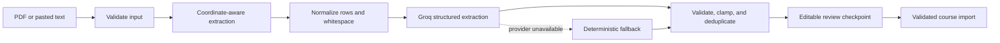

# TermPilot

TermPilot turns a course syllabus into an actionable semester plan. Students can paste syllabus text or upload a PDF, review extracted assignments, and track deadlines through a weekly calendar, priority queue, and workload forecast.

**Live demo:** [termpilot.vercel.app](https://termpilot.vercel.app)

## Why this project exists

Important deadlines are often buried in long documents and inconsistent tables. TermPilot combines layout-aware PDF extraction, structured AI parsing, deterministic fallback rules, and output validation to turn those documents into useful task data without silently accepting malformed results.

## Highlights

- Paste text or upload a text-based PDF syllabus
- Coordinate-aware PDF extraction that preserves table rows and columns
- Structured Groq output with date, type, weight, and effort validation
- Deterministic fallback parser when the AI provider is unavailable
- Editable review checkpoint before any extracted task is persisted
- Conflict-safe course imports that require explicit confirmation before replacement
- Passwordless Supabase Auth with a private workspace for every user
- PostgreSQL persistence protected by owner-scoped Row Level Security
- Parser provenance, page count, and extraction metadata in API responses
- Clear errors for scanned, damaged, oversized, and unsupported PDFs
- Weekly calendar, eight-week workload forecast, and priority-based focus list
- Due-date-first priority windows that prevent distant exams from displacing immediate work
- Multi-course task tracking, completion state, manual task entry, and dark mode
- Responsive and keyboard-accessible upload interactions
- Automated parser regression tests, including the original table-concatenation bug

## Parsing pipeline



The PDF renderer groups text fragments by their Y coordinate, sorts each row by X position, and inserts explicit column separators. This prevents table cells such as `September 8, 2026` and `40 points` from collapsing into `September 8, 202640`.

## Tech stack

| Layer | Technology |
| --- | --- |
| Frontend | React, Vite, Recharts, Supabase Auth |
| Backend | Node.js, Express |
| AI extraction | Groq (`llama-3.3-70b-versatile` by default) |
| PDF extraction | `pdf-parse` with a custom layout renderer |
| Persistence | Supabase Postgres with Row Level Security |
| Hosting | Vercel frontend, Render backend |
| Testing | Node test runner, Vite production build |

## Run locally

Requirements: Node.js 22 or newer and a Supabase project. A [Groq API key](https://console.groq.com/keys) is optional for local fallback parsing, but required to demonstrate AI extraction.

```bash
git clone https://github.com/Lolu07/termpilot.git
cd termpilot
```

Apply [the Supabase migration](supabase/migrations/20260805000100_auth_and_persistence.sql) in a development project before starting the app. Then configure `http://localhost:5173/**` as an allowed Auth redirect URL. The complete setup and production checklist is in [docs/SUPABASE_MIGRATION.md](docs/SUPABASE_MIGRATION.md).

Start the backend:

```bash
cd backend
cp .env.example .env
# Add the Groq and Supabase values to .env
npm ci
npm run dev
```

In a second terminal, start the frontend:

```bash
cd frontend
cp .env.example .env
npm ci
npm run dev
```

Open `http://localhost:5173`.

### Environment variables

Backend:

| Variable | Purpose |
| --- | --- |
| `GROQ_API_KEY` | Required for AI parsing; fallback parsing still works without it |
| `GROQ_MODEL` | Optional model override |
| `SUPABASE_URL` | Supabase project URL used for Auth verification and PostgREST |
| `SUPABASE_PUBLISHABLE_KEY` | Public project key used with each verified user's JWT |
| `ALLOWED_ORIGINS` | Comma-separated frontend origins allowed by CORS |
| `PORT` | Express port; defaults to `4000` |

Frontend:

| Variable | Purpose |
| --- | --- |
| `VITE_API_URL` | Backend API base URL, such as `http://localhost:4000/api` |
| `VITE_SUPABASE_URL` | Supabase project URL used by browser Auth |
| `VITE_SUPABASE_PUBLISHABLE_KEY` | Public browser-safe project key; authorization is enforced by RLS |

## API overview

| Method | Endpoint | Description |
| --- | --- | --- |
| `GET` | `/api/health` | Public process health and non-secret configuration status |
| `GET` | `/api/courses` | List courses and tasks |
| `POST` | `/api/parse/text` | Preview tasks from pasted syllabus text without saving |
| `POST` | `/api/parse/pdf` | Preview tasks from a PDF without saving |
| `POST` | `/api/courses/import` | Validate and save a reviewed import |
| `POST` | `/api/items` | Add a task manually |
| `PATCH` | `/api/items/:id` | Update a task |
| `PATCH` | `/api/items/:id/complete` | Mark a task complete |
| `DELETE` | `/api/items/:id` | Delete a task |
| `DELETE` | `/api/courses/:id` | Delete one owned course by UUID |
| `DELETE` | `/api/account/data` | Delete every course belonging to the signed-in user |

Every endpoint except `/api/health` requires `Authorization: Bearer <Supabase access token>`. Express verifies the token, derives the user ID from its signed claims, and performs each database request with that user's RLS context.

A successful parse includes non-secret provenance:

```json
{
  "parse_info": {
    "engine": "groq",
    "input_type": "pdf",
    "item_count": 17,
    "pages": 2,
    "character_count": 2889,
    "request_id": "a1b2c3d4"
  }
}
```

## Quality checks

```bash
cd backend && npm test
cd ../frontend && npm test && npm run build
```

The automated regression suite covers authentication middleware, owner-scoped repository queries, UUID mutations, sanitized imports, API contracts, layout reconstruction, flattened PDF tables, scanned-document detection, category-weight handling, date validation, deduplication, and due-date-first priority windows. Live Row Level Security is verified separately with two real Supabase users before release.

## Privacy and current limitations

- Syllabus text is sent to Groq for extraction. TermPilot does not persist the raw syllabus text, but users should avoid uploading documents containing information they do not want processed by the AI provider.
- Image-only or scanned PDFs are detected and rejected with guidance; OCR is not yet included.
- Course and task rows are isolated by Supabase Auth ownership and PostgreSQL Row Level Security. Uploaded PDF bytes and raw syllabus text are not stored.
- AI-extracted deadlines should always be reviewed against the original syllabus.

## Roadmap

- Google OAuth and a curated read-only recruiter demo workspace
- OCR support for scanned syllabi
- Calendar export (`.ics`) and planned study sessions before each deadline
- A sanitized multi-syllabus benchmark with published extraction accuracy

## License

MIT
