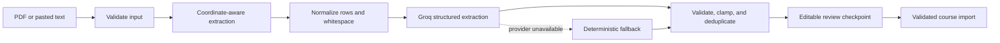

# TermPilot

TermPilot turns a course syllabus into an actionable semester plan. Students can paste syllabus text or upload a PDF, review extracted assignments, and track deadlines through a weekly calendar, priority queue, and workload forecast.

**Live demo:** [termpilot.vercel.app](https://termpilot.vercel.app)

## Why this project exists

Important deadlines are often buried in long documents and inconsistent tables. TermPilot combines layout-aware PDF extraction, structured AI parsing, deterministic fallback rules, and output validation to turn those documents into useful task data without silently accepting malformed results.

## Highlights

- Paste text or upload a text-based PDF syllabus
- Coordinate-aware PDF extraction that preserves table rows and columns
- Structured Groq output with date, type, weight, and effort validation
- Deterministic fallback parser when the AI provider is unavailable
- Editable review checkpoint before any extracted task is persisted
- Conflict-safe course imports that require explicit confirmation before replacement
- Parser provenance, page count, and extraction metadata in API responses
- Clear errors for scanned, damaged, oversized, and unsupported PDFs
- Weekly calendar, eight-week workload forecast, and priority-based focus list
- Multi-course task tracking, completion state, manual task entry, and dark mode
- Responsive and keyboard-accessible upload interactions
- Automated parser regression tests, including the original table-concatenation bug

## Parsing pipeline



The PDF renderer groups text fragments by their Y coordinate, sorts each row by X position, and inserts explicit column separators. This prevents table cells such as `September 8, 2026` and `40 points` from collapsing into `September 8, 202640`.

## Tech stack

| Layer | Technology |
| --- | --- |
| Frontend | React, Vite, Recharts |
| Backend | Node.js, Express |
| AI extraction | Groq (`llama-3.3-70b-versatile` by default) |
| PDF extraction | `pdf-parse` with a custom layout renderer |
| Current demo storage | Local JSON |
| Hosting | Vercel frontend, Render backend |
| Testing | Node test runner, Vite production build |

## Run locally

Requirements: Node.js 20 or newer and a [Groq API key](https://console.groq.com/keys).

```bash
git clone https://github.com/Lolu07/termpilot.git
cd termpilot
```

Start the backend:

```bash
cd backend
cp .env.example .env
# Add your GROQ_API_KEY to .env
npm ci
npm run dev
```

In a second terminal, start the frontend:

```bash
cd frontend
cp .env.example .env
npm ci
npm run dev
```

Open `http://localhost:5173`.

### Environment variables

Backend:

| Variable | Purpose |
| --- | --- |
| `GROQ_API_KEY` | Required for AI parsing; fallback parsing still works without it |
| `GROQ_MODEL` | Optional model override |
| `ALLOWED_ORIGINS` | Comma-separated frontend origins allowed by CORS |
| `PORT` | Express port; defaults to `4000` |

Frontend:

| Variable | Purpose |
| --- | --- |
| `VITE_API_URL` | Backend API base URL, such as `http://localhost:4000/api` |

## API overview

| Method | Endpoint | Description |
| --- | --- | --- |
| `GET` | `/api/health` | Service health and non-secret parser/storage readiness |
| `GET` | `/api/courses` | List courses and tasks |
| `POST` | `/api/parse/text` | Preview tasks from pasted syllabus text without saving |
| `POST` | `/api/parse/pdf` | Preview tasks from a PDF without saving |
| `POST` | `/api/courses/import` | Validate and save a reviewed import |
| `POST` | `/api/items` | Add a task manually |
| `PATCH` | `/api/items/:id` | Update a task |
| `DELETE` | `/api/items/:id` | Delete a task |
| `DELETE` | `/api/courses/:name` | Delete a course |
| `POST` | `/api/reset` | Reset demo data |

A successful parse includes non-secret provenance:

```json
{
  "parse_info": {
    "engine": "groq",
    "input_type": "pdf",
    "item_count": 17,
    "pages": 2,
    "character_count": 2889,
    "request_id": "a1b2c3d4"
  }
}
```

## Quality checks

```bash
cd backend && npm test
cd ../frontend && npm test && npm run build
```

The automated regression suite covers layout reconstruction, flattened PDF tables, scanned-document detection, date validation, reviewed-import materialization, strict replacement confirmation, weight extraction, type inference, deduplication, timezone-safe date helpers, and overdue priority behavior. Manual release QA also runs the preview/no-write/import/conflict flow end to end with a known 17-item PDF fixture.

## Privacy and current limitations

- Syllabus text is sent to Groq for extraction. TermPilot does not persist the raw syllabus text, but users should avoid uploading documents containing information they do not want processed by the AI provider.
- Image-only or scanned PDFs are detected and rejected with guidance; OCR is not yet included.
- The public demo currently uses a shared, ephemeral JSON store. It is suitable for demonstration, not private academic data, and may reset during deployments.
- AI-extracted deadlines should always be reviewed against the original syllabus.

## Roadmap

- Per-user authentication and persistent Postgres storage ([Supabase migration package](docs/SUPABASE_MIGRATION.md))
- OCR support for scanned syllabi
- Calendar export (`.ics`) and planned study sessions before each deadline
- A sanitized multi-syllabus benchmark with published extraction accuracy

## License

MIT
